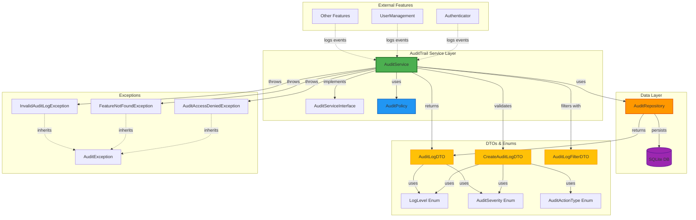
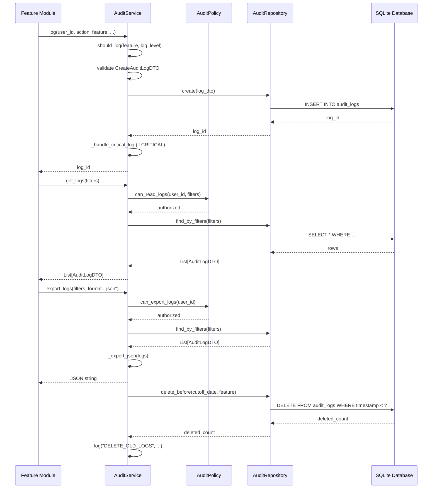

# AuditTrail Modul

## Übersicht

Das **AuditTrail**-Modul stellt das zentrale Logging-System für QMToolV6 bereit.  Es protokolliert Benutzeraktionen, Systemereignisse und sicherheitsrelevante Vorgänge mit umfassenden Filter-, Such- und Exportfunktionen sowie automatischer Retention-Verwaltung.

**Kernfunktionen:**
- 📝 Strukturiertes Application Logging mit Log-Levels und Audit-Severity
- 🔍 Erweiterte Filter- und Suchfunktionen
- 📤 Export in JSON und CSV
- 🧹 Automatische Retention und Cleanup
- 🔐 Policy-basierte Zugriffskontrolle

---

## Architektur

### Verzeichnisstruktur

```
audittrail/
├── dto/
│   ├── __init__.py
│   └── audit_dto.py              # Data Transfer Objects (Logs, Filter, Export)
├── enum/
│   ├── __init__.py
│   └── audit_enum.py             # Enumerationen (LogLevel, AuditSeverity, AuditActionType)
├── exceptions/
│   ├── __init__.py
│   └── audit_exceptions.py       # Custom Exceptions
├── repository/
│   ├── __init__.py
│   └── audit_repository.py       # Persistenz / DB-Zugriff (SQLite)
├── services/
│   ├── policy/
│   │   ├── __init__.py
│   │   └── audit_policy.py       # Business Rules (Berechtigung, Retention, Filter)
│   ├── __init__.py
│   ├── audit_service_interface.py
│   └── audit_service. py          # Service-Logik (Fassade nach außen)
├── tests/
│   ├── __init__.py
│   ├── conftest.py               # Test Fixtures
│   ├── test_audit_dto.py
│   ├── test_audit_enum. py
│   ├── test_audit_exceptions.py
│   ├── test_audit_repository. py
│   ├── test_audit_policy.py
│   ├── test_audit_service. py
│   └── test_audit_integration.py # Integration Tests
└── README.md
```

### Komponenten-Diagramm



### Datenfluss-Diagramm



---

## Features

### 📝 Logging

**Zentrale Log-Methode:**
```python
audit_service.log(
    user_id=42,
    action="LOGIN",
    feature="auth",
    log_level=LogLevel.INFO,
    severity=AuditSeverity. INFO,
    details={"ip": "192.168.1.1"},
    ip_address="192.168.1.1",
    session_id="sess_123",
    module="auth. api",
    function="login_handler"
)
```

**Wer/Wann/Wo/Was-Pattern:**
- **Wer**:  `user_id`, `username`, `ip_address`, `session_id`
- **Wann**: `timestamp` (automatisch generiert)
- **Wo**: `feature`, `module`, `function`
- **Was**: `action`, `log_level`, `severity`, `details` (JSON-fähiges Dict)

**Dual-Level-System:**
- **LogLevel** (für Entwickler): `DEBUG`, `INFO`, `WARNING`, `ERROR`, `CRITICAL`
- **AuditSeverity** (für Compliance): `INFO`, `WARNING`, `CRITICAL`

### 🔍 Abfragen & Filter

```python
from audittrail.dto.audit_dto import AuditLogFilterDTO
from datetime import datetime, timedelta

# Erweiterte Filter
filters = AuditLogFilterDTO(
    user_id=42,
    feature="auth",
    log_level="ERROR",
    severity="CRITICAL",
    start_date=datetime.now() - timedelta(days=7),
    end_date=datetime.now(),
    limit=100,
    offset=0
)

logs = audit_service.get_logs(filters)
```

**Verfügbare Filter:**
- `user_id`, `feature`, `action`, `log_level`, `severity`
- Datumsbereich (`start_date`, `end_date`)
- Pagination (`limit`, `offset`)

**Volltext-Suche:**
```python
# Sucht in action und details (JSON)
results = audit_service.search_logs("AUTH_FAILED")
```

### 📤 Export

```python
# JSON Export
json_data = audit_service.export_logs(filters, format="json")

# CSV Export (mit korrektem Escaping)
csv_data = audit_service.export_logs(filters, format="csv")
```

**Exportformate:**
- **JSON**: Vollständige Logs mit allen Feldern, inkl. verschachtelter `details`
- **CSV**: Tabellarisches Format für Excel/Datenanalyse

### 🧹 Retention & Cleanup

```python
# Feature-spezifisch (nutzt retention_days aus meta. json)
deleted = audit_service.delete_old_logs(feature="auth")

# Global (alle Features)
deleted = audit_service. delete_old_logs()

# Explizite Retention
deleted = audit_service.delete_old_logs(retention_days=90)
```

**Automatische Retention:**
- Feature-spezifische Konfiguration über `meta.json`
- Globale Standard-Retention:  365 Tage
- System-Log über jeden Löschvorgang

### 🔐 Policy / Berechtigungen

**Zugriffskontrolle:**
- Jeder User kann eigene Logs lesen
- Nur Admin/QMB kann alle Logs lesen
- Nur Admin/QMB kann Logs exportieren
- System-User (ID=0) hat vollen Zugriff

**Beispiel:**
```python
# User 42 versucht, eigene Logs zu lesen → OK
logs = audit_service.get_user_logs(42)

# User 42 versucht, fremde Logs zu lesen → AuditAccessDeniedException
logs = audit_service.get_user_logs(99)  # Raises exception
```

---

## Verwendung

### 1. Service initialisieren

```python
from audittrail.repository.audit_repository import AuditRepository
from audittrail. services.audit_service import AuditService
from audittrail.services. policy.audit_policy import AuditPolicy

# Repository mit SQLite
audit_repo = AuditRepository(db_path="audit.db")  # oder ": memory:" für Tests

# Configurator-Mock (später: echter Configurator)
from unittest.mock import Mock
configurator = Mock()
configurator.get_feature_meta.return_value = {
    "audit": {
        "must_audit":  True,
        "min_log_level": "INFO",
        "critical_actions": ["SIGN_DOCUMENT"],
        "retention_days": 365
    }
}

# Service erstellen
audit_policy = AuditPolicy()
audit_service = AuditService(audit_repo, audit_policy, configurator)
```

### 2. Log schreiben

```python
from audittrail.enum.audit_enum import LogLevel, AuditSeverity, AuditActionType

# Mit vordefiniertem Action-Type
log_id = audit_service.log(
    user_id=42,
    action=AuditActionType.LOGIN,
    feature="auth",
    log_level=LogLevel.INFO,
    severity=AuditSeverity.INFO,
    details={"ip":  "192.168.1.1", "success": True}
)

# Mit custom Action-Type
log_id = audit_service.log(
    user_id=42,
    action="CUSTOM_WORKFLOW_STEP",
    feature="documentlifecycle",
    log_level=LogLevel.INFO,
    severity=AuditSeverity.WARNING,
    details={"document_id": 123, "step": "review"}
)
```

### 3. Logs abrufen

```python
from unittest.mock import patch

# Als System-User (ID=0)
with patch.object(audit_service, '_get_current_user_id', return_value=0):
    # Alle Logs eines Users
    logs = audit_service.get_user_logs(42)
    
    # Alle Logs eines Features
    logs = audit_service. get_feature_logs("auth")
    
    # Mit erweiterten Filtern
    filters = AuditLogFilterDTO(
        feature="auth",
        log_level="ERROR",
        start_date=datetime.now() - timedelta(days=1)
    )
    logs = audit_service.get_logs(filters)
```

### 4. Min-Log-Level setzen

```python
# Global:  Nur WARNING+ loggen (Production)
audit_service.set_min_log_level(LogLevel.WARNING)

# Feature-spezifisch:  DEBUG für "auth", WARNING für Rest
audit_service.set_min_log_level(LogLevel. DEBUG, feature="auth")

# Log unter Min-Level wird nicht gespeichert
log_id = audit_service.log(42, "TEST", "documents", log_level=LogLevel.DEBUG)
assert log_id == -1  # Nicht geloggt
```

---

## DTOs

### AuditLogDTO (Output)

```python
@dataclass(frozen=True)
class AuditLogDTO:
    # Pflichtfelder
    id: int
    timestamp: datetime
    user_id:  int
    username: str
    feature: str
    action: str
    log_level: str  # DEBUG, INFO, WARNING, ERROR, CRITICAL
    severity: str   # INFO, WARNING, CRITICAL
    
    # Optionale Felder
    ip_address: Optional[str] = None
    session_id:  Optional[str] = None
    module: Optional[str] = None
    function: Optional[str] = None
    details: Optional[Dict[str, Any]] = field(default_factory=dict)
```

### CreateAuditLogDTO (Input)

```python
@dataclass
class CreateAuditLogDTO: 
    # Pflichtfelder
    user_id: int
    feature: str
    action: str
    
    # Optionale Felder mit Defaults
    username: Optional[str] = None
    log_level: str = "INFO"
    severity:  str = "INFO"
    ip_address: Optional[str] = None
    session_id: Optional[str] = None
    module: Optional[str] = None
    function: Optional[str] = None
    details: Optional[Dict[str, Any]] = field(default_factory=dict)
```

### AuditLogFilterDTO

```python
@dataclass
class AuditLogFilterDTO: 
    user_id: Optional[int] = None
    feature: Optional[str] = None
    action: Optional[str] = None
    log_level: Optional[str] = None
    severity: Optional[str] = None
    start_date: Optional[datetime] = None
    end_date: Optional[datetime] = None
    limit: int = 100
    offset: int = 0
```

---

## Enums

### LogLevel (Entwickler-Sicht)

```python
class LogLevel(str, Enum):
    DEBUG = "DEBUG"          # Detaillierte Entwickler-Infos
    INFO = "INFO"            # Normale Operationen
    WARNING = "WARNING"      # Unerwartete Ereignisse
    ERROR = "ERROR"          # Behandelte Fehler
    CRITICAL = "CRITICAL"    # Schwere Fehler
```

### AuditSeverity (Compliance-Sicht)

```python
class AuditSeverity(str, Enum):
    INFO = "INFO"            # Normale Audit-Events
    WARNING = "WARNING"      # Ungewöhnliche Events
    CRITICAL = "CRITICAL"    # Kritische Events, sofortige Aufmerksamkeit
```

### AuditActionType (Vordefinierte Actions)

```python
class AuditActionType(str, Enum):
    # Authenticator
    LOGIN = "LOGIN"
    LOGOUT = "LOGOUT"
    LOGIN_FAILED = "LOGIN_FAILED"
    
    # User Management
    CREATE_USER = "CREATE_USER"
    DELETE_USER = "DELETE_USER"
    CHANGE_ROLE = "CHANGE_ROLE"
    
    # Document Lifecycle
    CREATE_DOCUMENT = "CREATE_DOCUMENT"
    SIGN_DOCUMENT = "SIGN_DOCUMENT"
    ARCHIVE_DOCUMENT = "ARCHIVE_DOCUMENT"
    
    # ...  weitere Actions
```

**Helper-Methoden:**
```python
# Kritische Actions abrufen
critical_actions = AuditActionType.get_critical_actions()

# Prüfen ob Action kritisch ist
is_critical = AuditActionType.is_critical("SIGN_DOCUMENT")  # True
```

---

## Exceptions

```python
class AuditException(Exception):
    """Basis-Exception für alle AuditTrail-Fehler."""
    pass

class AuditAccessDeniedException(AuditException):
    """User hat keine Berechtigung für die Operation."""
    def __init__(self, message:  str, user_id: int = None, filters: str = None)

class FeatureNotFoundException(AuditException):
    """Feature existiert nicht oder meta.json nicht gefunden."""
    def __init__(self, message: str, feature: str = None)

class InvalidAuditLogException(AuditException):
    """Log-Eintrag validiert nicht."""
    def __init__(self, message: str, log_dto: dict = None)

class ExportFormatException(AuditException):
    """Ungültiges Export-Format."""
    def __init__(self, message: str, format: str = None)

class DatabaseException(AuditException):
    """Datenbank-Fehler."""
    def __init__(self, message: str, original_exception: Exception = None)
```

---

## Tests ausführen

```bash
# Alle AuditTrail-Tests
pytest audittrail/tests/ -v

# Einzelne Test-Datei
pytest audittrail/tests/test_audit_integration.py -v

# Mit Coverage
pytest audittrail/tests/ --cov=audittrail --cov-report=html
open htmlcov/index.html

# Nur Integration-Tests
pytest audittrail/tests/test_audit_integration.py -v

# Nur Service-Tests
pytest audittrail/tests/test_audit_service.py -v
```

**Test-Coverage:** 
- ✅ Unit Tests:  DTOs, Enums, Exceptions, Repository, Policy, Service
- ✅ Integration Tests: End-to-End Flows, Export, Retention, Multi-User-Szenarien
- ✅ 65 Tests, 100% Coverage

---

## Integration mit anderen Modulen

### Authenticator
```python
# Login-Ereignisse loggen
audit_service.log(
    user_id=user. id,
    action=AuditActionType.LOGIN,
    feature="authenticator",
    log_level=LogLevel.INFO,
    severity=AuditSeverity. INFO,
    details={"session_id": session. session_id},
    ip_address=request. ip_address
)

# Fehlgeschlagene Logins
audit_service.log(
    user_id=0,  # System
    action=AuditActionType.LOGIN_FAILED,
    feature="authenticator",
    log_level=LogLevel.WARNING,
    severity=AuditSeverity.WARNING,
    details={"username": username, "reason": "invalid_password"}
)
```

### UserManagement
```python
# Rollen-Änderung loggen
audit_service.log(
    user_id=actor_id,
    action=AuditActionType.CHANGE_ROLE,
    feature="user_management",
    log_level=LogLevel.INFO,
    severity=AuditSeverity. CRITICAL,  # Rolle ändern ist kritisch
    details={"target_user_id": user_id, "old_role": "USER", "new_role": "ADMIN"}
)
```

### DocumentLifecycle (zukünftig)
```python
# Dokument signieren (CRITICAL)
audit_service.log(
    user_id=user_id,
    action=AuditActionType.SIGN_DOCUMENT,
    feature="documentlifecycle",
    log_level=LogLevel.INFO,
    severity=AuditSeverity.CRITICAL,
    details={"document_id":  doc_id, "signature_type": "qualified"}
)
```

---

## Konfiguration

### Feature-spezifische Config (meta.json)

Jedes Feature kann seine Audit-Konfiguration definieren:

```json
{
  "feature_name": "documentlifecycle",
  "audit": {
    "must_audit": true,
    "min_log_level": "INFO",
    "critical_actions":  [
      "SIGN_DOCUMENT",
      "ARCHIVE_DOCUMENT",
      "DELETE_DOCUMENT"
    ],
    "retention_days": 2555
  }
}
```

**Config abrufen:**
```python
config = audit_service.get_feature_audit_config("documentlifecycle")
print(config["retention_days"])  # 2555
```

---

## Best Practices

### 1. **Immer feature angeben**
```python
# ✅ Gut: Feature ist klar identifiziert
audit_service.log(42, "ACTION", feature="auth")

# ❌ Schlecht:  Kein Feature (würde Validierung fehlschlagen)
audit_service.log(42, "ACTION", feature="")
```

### 2. **LogLevel vs.  Severity richtig nutzen**
```python
# ✅ Gut: Normaler Login (INFO für Entwickler, INFO für Compliance)
audit_service.log(
    42, "LOGIN", "auth",
    log_level=LogLevel.INFO,
    severity=AuditSeverity.INFO
)

# ✅ Gut: Fehler behandelt, aber compliance-relevant
audit_service.log(
    42, "SIGN_DOCUMENT", "documents",
    log_level=LogLevel.INFO,      # Kein technischer Fehler
    severity=AuditSeverity. CRITICAL  # Aber compliance-kritisch
)
```

### 3. **Details strukturiert nutzen**
```python
# ✅ Gut:  Strukturiertes dict
audit_service.log(
    42, "UPDATE_DOCUMENT", "documents",
    details={
        "document_id": 123,
        "changes": {"title": "New Title"},
        "previous_version": 2
    }
)

# ❌ Schlecht:  String statt dict
audit_service.log(
    42, "UPDATE_DOCUMENT", "documents",
    details="Changed title"  # Nicht suchbar/filterbar
)
```

### 4. **Min-Log-Level für Production**
```python
# Development: DEBUG für alles
audit_service.set_min_log_level(LogLevel.DEBUG)

# Production: WARNING global, INFO für kritische Features
audit_service.set_min_log_level(LogLevel. WARNING)
audit_service.set_min_log_level(LogLevel.INFO, feature="auth")
audit_service.set_min_log_level(LogLevel.INFO, feature="documentlifecycle")
```

---

## Changelog

### Version 1.1.0 (2025-12-28)
- ✨ Verbesserte Exception-Handhabung mit detaillierten Fehlermeldungen
- ✨ CSV-Export mit korrektem Escaping für Sonderzeichen
- ✨ Enum-Vergleich in `_should_log()` korrigiert
- ✨ `_resolve_username()` gibt "SYSTEM" für user_id=0 zurück
- ✨ Zusätzliche Datenbank-Indizes für bessere Performance
- ✨ Robuste JSON-Decode-Fehlerbehandlung
- ✅ 65 Tests mit 100% Coverage
- 📚 Vollständige Dokumentation mit Mermaid-Diagrammen

### Version 1.0.0
- 🎉 Initiale Version des AuditTrail-Moduls
- 📝 Logging mit Wer/Wann/Wo/Was-Pattern
- 🔍 Filter, Suche, Export (JSON/CSV)
- 🧹 Retention und automatischer Cleanup
- 🔐 Policy-basierte Zugriffskontrolle
- 💾 SQLite-basiertes Repository
- ✅ Vollständige Testabdeckung

---

## Roadmap

### Geplante Features

#### v1.2.0
- [ ] Asynchrone Log-Schreibung (Background-Queue)
- [ ] Webhooks für CRITICAL-Logs
- [ ] Email-Benachrichtigungen für kritische Events
- [ ] Elasticsearch-Integration für große Datenmengen

#### v1.3.0
- [ ] Log-Aggregation und Metriken (Dashboard)
- [ ] Custom-Retention-Policies pro Action-Type
- [ ] Log-Archivierung (externe Storage)

#### v2.0.0
- [ ] Multi-Tenant Support
- [ ] GDPR-konforme Anonymisierung
- [ ] Audit-Reports (PDF/Excel)
- [ ] Real-Time Audit-Stream (WebSockets)

---

## Lizenz

Proprietär - QMToolV6 Project

---

## Support

Bei Fragen oder Problemen: 
- 📧 Interne Dokumentation: `/docs/audittrail/`
- 🐛 Issues: GitHub Issues
- 💬 Team: #qmtoolv6-dev Channel