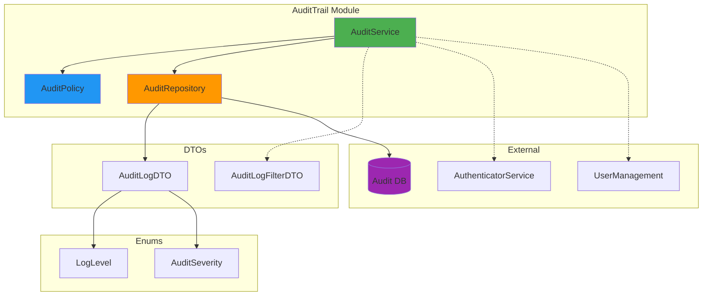

Hier ist eine bereinigte, eigenständige `audittrail/README.md`, in der das Mermaid\-Diagramm korrekt eingebaut ist (analog zum `authenticator`\-README, ohne die Meta\-Erklärung außen herum):

```markdown
# AuditTrail Modul

## Übersicht

Das **AuditTrail**\-Modul ist verantwortlich für das zentrale Logging von Aktionen im QMToolV6.
Es protokolliert Benutzeraktionen, Systemereignisse und sicherheitsrelevante Vorgänge, stellt Filter\-, Such\- und Exportfunktionen bereit und unterstützt automatische Löschroutinen (Retention).

## Architektur

### Verzeichnisstruktur

```
audittrail/
├── dto/
│   └── audit_dto.py              # Data Transfer Objects (Logs, Filter, Export)
├── enum/
│   └── audit_enum.py             # Enumerationen (LogLevel, AuditSeverity)
├── exceptions/
│   └── audit_exceptions.py       # Custom Exceptions
├── repository/
│   └── audit_repository.py       # Persistenz / DB-Zugriff (z.B. SQLite)
├── services/
│   ├── policy/
│   │   └── audit_policy.py       # Business Rules (Berechtigung, Retention, Filter)
│   ├── audit_service_interface.py
│   └── audit_service.py          # Service-Logik (Fassade nach außen)
├── tests/
│   ├── conftest.py
│   ├── test_audit_dto.py
│   ├── test_audit_integration.py
│   ├── test_audit_policy.py
│   ├── test_audit_repository.py
│   └── test_audit_service.py
└── README.md
```



## Features

### 📝 Logging

* Zentrales Audit\-Logging für Aktionen und Events.
* Unterstützung für verschiedene Log\-Level (`LogLevel`) und Schweregrade (`AuditSeverity`).
* Kontextinformationen: `user_id`, `feature`, `ip_address`, `session_id`, `module`, `function`, `details` (JSON\-fähig).

### 🔍 Abfragen & Filter

* Filter nach:
  * `user_id`, `feature`, `log_level`, `severity`
  * Datumsbereich (`start_date`, `end_date`)
  * Pagination (`limit`, `offset`)
* Volltext\-ähnliche Suche über `search_logs(keyword)` (z.B. über `details`).

### 📤 Export

* Export von Logs als:
  * JSON (`format="json"`)
  * CSV (`format="csv"`, inkl. korrekt geescapeden Sonderzeichen).
* Geeignet für externe Auswertungen oder Reports.

### 🧹 Retention & Cleanup

* Löschen alter Einträge per `delete_old_logs(feature: str | None = None)`.
* Optional feature\-spezifische Retention (z.B. nur `auth`\-Logs löschen).
* Unterstützt Compliance\-Vorgaben durch kontrollierbare Aufbewahrungsdauer.

### 🔐 Policy / Berechtigungen

* Policy kapselt:
  * Zugriffsbeschränkung (User sehen nur eigene Logs, außer Admin/System).
  * Validierungslogik für Filter und Export.
  * Regeln für kritische Logs (`AuditSeverity.CRITICAL`).

## Verwendung

### 1\. Service initialisieren

```python
from audittrail.repository.audit_repository import AuditRepository
from audittrail.services.audit_service import AuditService

# Beispiel: SQLite-Connection oder generische DB-Verbindung erzeugen
conn = create_audit_db_connection()

audit_repo = AuditRepository(conn)
audit_service = AuditService(audit_repository=audit_repo)
```

### 2\. Log schreiben

```python
from audittrail.enum.audit_enum import LogLevel, AuditSeverity

log_id = audit_service.log(
    user_id=42,
    action="LOGIN",
    feature="auth",
    log_level=LogLevel.INFO,
    severity=AuditSeverity.INFO,
    details={"ip": "192.168.1.1"},
    ip_address="192.168.1.1",
    session_id="sess_123",
    module="auth.api",
    function="login_handler"
)
```

### 3\. Logs abrufen (mit Filter)

```python
from datetime import datetime, timedelta
from audittrail.dto.audit_dto import AuditLogFilterDTO

filters = AuditLogFilterDTO(
    user_id=42,
    feature="auth",
    start_date=datetime.now() - timedelta(days=1),
    limit=100,
    offset=0,
)

logs = audit_service.get_logs(filters)
for log in logs:
    print(log.timestamp, log.action, log.details)
```

### 4\. Suche über alle Features

```python
results = audit_service.search_logs("SPECIAL")
```

### 5\. Export

```python
filters = AuditLogFilterDTO()
json_export = audit_service.export_logs(filters, format="json")
csv_export = audit_service.export_logs(filters, format="csv")
```

### 6\. Retention / Cleanup

```python
# Alle alten Logs eines Features löschen (z.B. älter als Policy-Grenze)
deleted_count = audit_service.delete_old_logs(feature="auth")
```

## DTOs (Beispiele)

Typische DTOs im Modul:

* `AuditLogDTO` – Repräsentation eines einzelnen Log\-Eintrags.
* `AuditLogFilterDTO` – Filterparameter (User, Feature, Level, Datum, Pagination).
* Optional: `AuditExportResultDTO` oder einfache Rückgabeformate (String / List\[DTO]).

## Enums

* `LogLevel` – z.B. `DEBUG`, `INFO`, `WARNING`, `ERROR`, `CRITICAL`.
* `AuditSeverity` – fachliche Schweregrade (z.B. `INFO`, `WARNING`, `CRITICAL`).

## Exceptions

* `AuditException` – Basis\-Exception.
* `AuditPolicyException` – Verletzung einer Audit\-Policy.
* `AuditExportException` – Fehler beim Export.
* `AuditNotFoundException` – Einträge nicht gefunden (optional / je nach Implementierung).

## Tests ausführen

```bash
# Alle AuditTrail-Tests
pytest audittrail/tests/

# Einzelne Test-Datei
pytest audittrail/tests/test_audit_integration.py

# Mit Coverage
pytest audittrail/tests/ --cov=audittrail --cov-report=html
```

## Integration mit anderen Modulen

* **Authenticator**: Loggt sicherheitsrelevante Ereignisse wie Login, Logout, Session\-Fehler.
* **UserManagement**: Kann Änderungen an Benutzerdaten, Rollenwechsel oder Sperrungen ins AuditTrail schreiben.
* Weitere Features können über den `AuditService` zentral protokollieren, ohne direkt mit der Datenbank zu sprechen.

## Changelog

### Version 1.0.0
* Initiale Version des AuditTrail\-Moduls.
* Logging, Filter, Suche, Export (JSON/CSV), Retention.
* SQL\-basiertes Repository (z.B. SQLite).
* Vollständige Testabdeckung inkl. Integrations\-Tests.

## Lizenz

Proprietär \- QMToolV6 Project
```