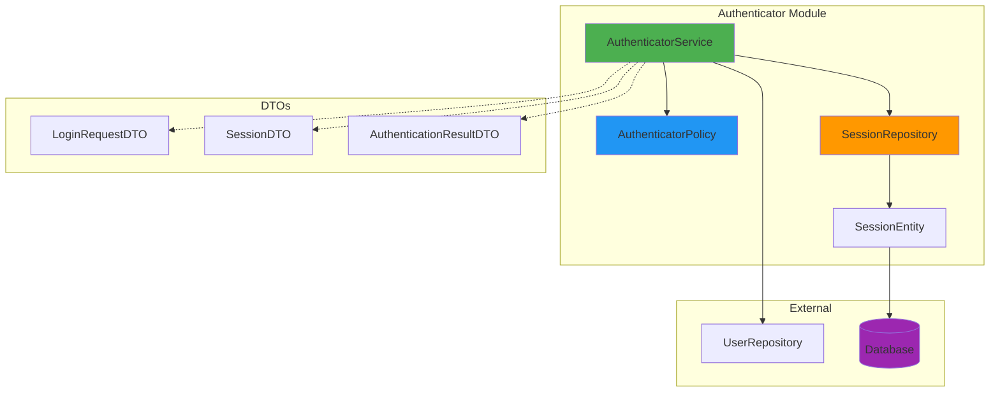
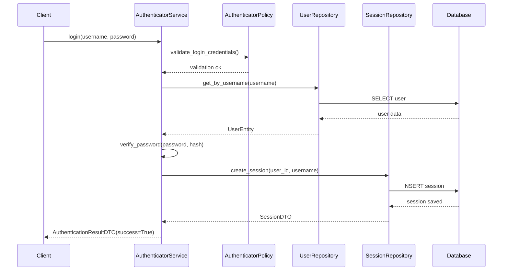
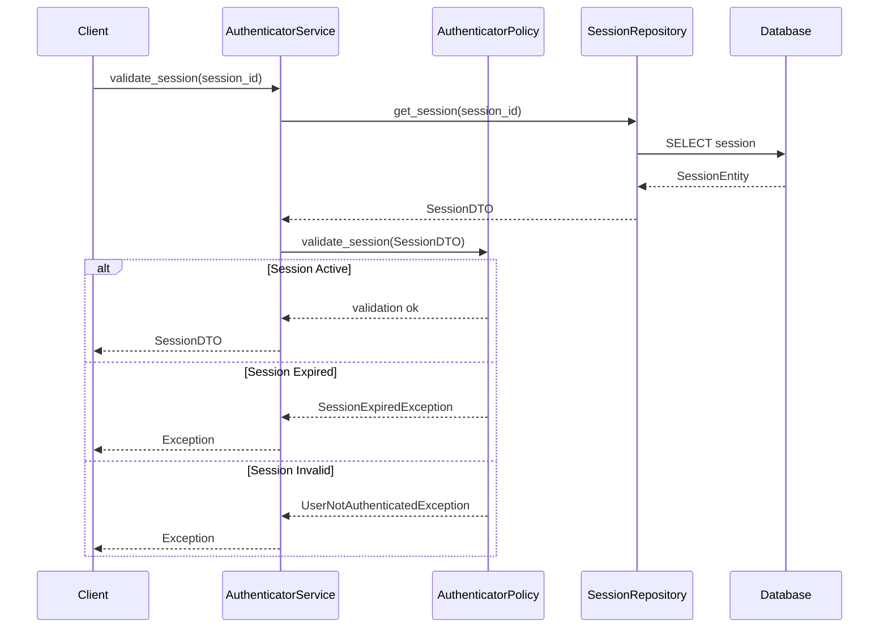
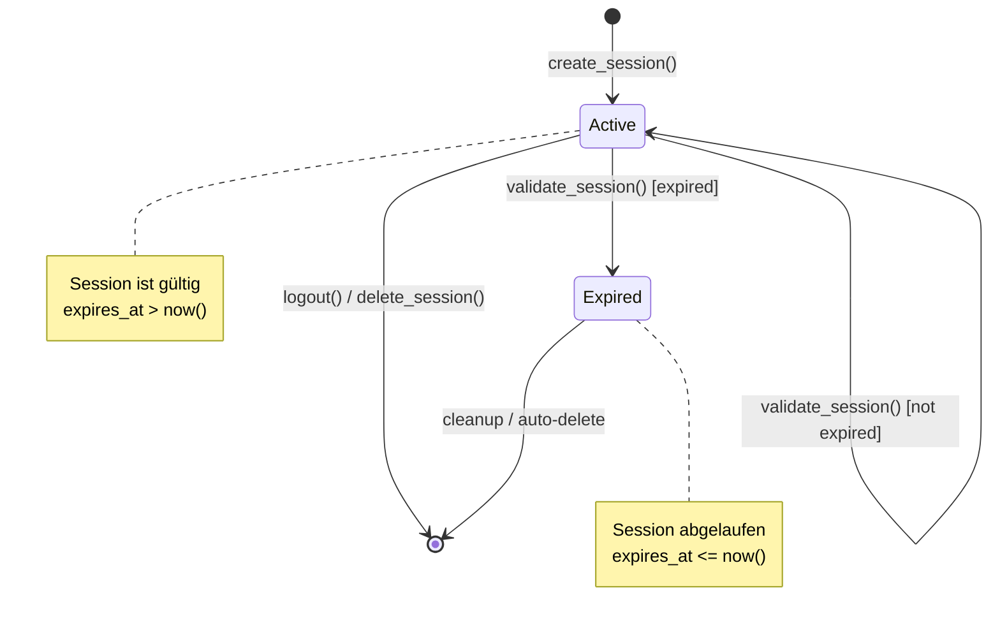
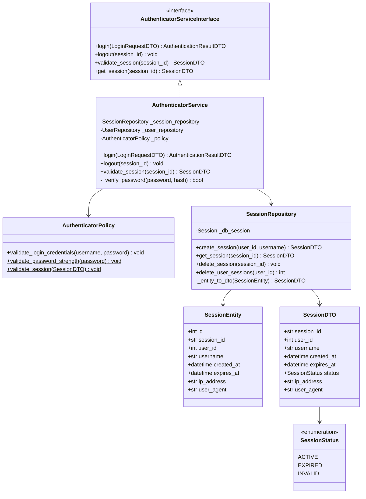

Perfekt! Hier ist die **vollständige README mit allen Mermaid-Diagrammen** an den richtigen Stellen:

## `authenticator/README.md`

```markdown
# Authenticator Modul

## Übersicht

Das **Authenticator**-Modul ist verantwortlich für die Authentifizierung und Session-Verwaltung in QMToolV6. Es bietet sichere Login-/Logout-Funktionen und Session-Validierung.

## Architektur

### Verzeichnisstruktur

```
authenticator/
├── dto/
│   └── auth_dto.py              # Data Transfer Objects
├── enum/
│   └── auth_enum.py             # Enumerations (SessionStatus)
├── exceptions/
│   └── authenticator_exceptions.py  # Custom Exceptions
├── repository/
│   └── session_repository.py    # Datenbankzugriff für Sessions
├── services/
│   ├── policy/
│   │   └── authenticator_policy.py  # Business Rules
│   ├── authenticator_service_interface.py
│   └── authenticator_service.py     # Service-Logik
├── tests/
│   ├── conftest.py              # Test Fixtures
│   ├── test_session_repository.py
│   ├── test_authenticator_policy.py
│   └── test_authenticator_service.py
└── README.md                    # Diese Datei
```

### Komponenten-Diagramm



## Features

### 🔐 Authentifizierung
- Sichere Passwort-Validierung mit bcrypt
- Session-basierte Authentifizierung
- IP-Adresse und User-Agent Tracking

### 📋 Session-Verwaltung
- Session-Erstellung mit konfigurierbarer Gültigkeit
- Session-Validierung
- Automatische Ablauferkennung
- Multi-Session Support pro Benutzer

### ✅ Validierung
- Passwort-Stärke-Prüfung
- Session-Status-Validierung
- Credential-Validierung

## Verwendung

### 1. Service initialisieren

```python
from sqlalchemy.orm import Session
from authenticator.services.authenticator_service import AuthenticatorService
from user_management.repository.user_repository import UserRepository

# Datenbank-Session erstellen
db_session: Session = create_db_session()

# User Repository (aus user_management Modul)
user_repo = UserRepository(db_session)

# Service erstellen
auth_service = AuthenticatorService(
    db_session=db_session,
    user_repository=user_repo
)
```

### 2. Login durchführen

```python
from authenticator.dto.auth_dto import LoginRequestDTO

# Login-Daten erstellen
login_request = LoginRequestDTO(
    username="max.mustermann",
    password="SecurePass@123"
)

# Login durchführen
result = auth_service.login(
    login_request=login_request,
    ip_address="192.168.1.100",
    user_agent="Mozilla/5.0..."
)

if result.success:
    session_id = result.session.session_id
    print(f"Login erfolgreich! Session-ID: {session_id}")
else:
    print(f"Login fehlgeschlagen: {result.error_message}")
```

#### Login-Flow Sequenz



### 3. Session validieren

```python
try:
    session = auth_service.validate_session(session_id)
    print(f"Session gültig für User: {session.username}")
except SessionExpiredException:
    print("Session abgelaufen")
except UserNotAuthenticatedException:
    print("Ungültige Session")
```

#### Session-Validierung Sequenz



### 4. Logout durchführen

```python
auth_service.logout(session_id)
print("Logout erfolgreich")
```

## Session Lifecycle



## DTOs (Data Transfer Objects)

### LoginRequestDTO
```python
@dataclass
class LoginRequestDTO:
    username: str
    password: str
```

### SessionDTO
```python
@dataclass
class SessionDTO:
    session_id: str
    user_id: int
    username: str
    created_at: datetime
    expires_at: datetime
    status: SessionStatus
    ip_address: Optional[str] = None
    user_agent: Optional[str] = None
```

### AuthenticationResultDTO
```python
@dataclass
class AuthenticationResultDTO:
    success: bool
    session: Optional[SessionDTO] = None
    error_message: Optional[str] = None
```

## Klassenstruktur



## Enums

### SessionStatus
```python
class SessionStatus(Enum):
    ACTIVE = "active"      # Session ist gültig
    EXPIRED = "expired"    # Session abgelaufen
    INVALID = "invalid"    # Session ungültig
```

## Exceptions

| Exception | Beschreibung |
|-----------|-------------|
| `AuthenticatorException` | Basis-Exception |
| `InvalidCredentialsException` | Ungültige Login-Daten |
| `SessionNotFoundException` | Session nicht gefunden |
| `SessionExpiredException` | Session abgelaufen |
| `UserNotAuthenticatedException` | Benutzer nicht authentifiziert |
| `PasswordHashingException` | Fehler beim Passwort-Hashing |

## Business Rules (Policy)

### Passwort-Anforderungen
- Mindestlänge: 8 Zeichen
- Mindestens ein Großbuchstabe
- Mindestens ein Kleinbuchstabe
- Mindestens eine Ziffer
- Mindestens ein Sonderzeichen

### Session-Gültigkeit
- Standard-Gültigkeit: 24 Stunden
- Automatische Ablauferkennung
- Status-basierte Validierung

## Repository

### SessionRepository

```python
class SessionRepository:
    def create_session(
        self,
        user_id: int,
        username: str,
        expires_in_hours: int = 24,
        ip_address: Optional[str] = None,
        user_agent: Optional[str] = None
    ) -> SessionDTO
    
    def get_session(self, session_id: str) -> SessionDTO
    
    def delete_session(self, session_id: str) -> None
    
    def delete_user_sessions(self, user_id: int) -> int
```

## Tests ausführen

```bash
# Alle Tests
pytest authenticator/tests/

# Einzelne Test-Datei
pytest authenticator/tests/test_authenticator_service.py

# Mit Coverage
pytest authenticator/tests/ --cov=authenticator --cov-report=html
```

## Abhängigkeiten

- `sqlalchemy` - ORM für Datenbankzugriff
- `bcrypt` - Passwort-Hashing
- `pytest` - Testing Framework
- `user_management` - User-Repository

## Integration mit anderen Modulen

### user_management
- Verwendet `UserRepository` zum Laden von User-Daten
- Verifiziert Passwort-Hashes

### Zukünftige Module
- **API**: REST-Endpoints für Login/Logout
- **Frontend**: Session-basierte Autorisierung

## Sicherheitshinweise

⚠️ **Wichtig:**
- Passwörter werden niemals im Klartext gespeichert
- Session-IDs sind kryptographisch sicher (32 Bytes)
- IP-Adressen werden geloggt für Audit-Zwecke
- Session-Timeout verhindert Session-Hijacking

## Beispiel-Workflow

```python
# 1. Login
login_request = LoginRequestDTO(username="user", password="pass")
result = auth_service.login(login_request, "127.0.0.1", "Browser/1.0")

if result.success:
    session_id = result.session.session_id
    
    # 2. Session validieren (bei jedem Request)
    try:
        session = auth_service.validate_session(session_id)
        # Request verarbeiten...
    except SessionExpiredException:
        # User zur Login-Seite umleiten
        pass
    
    # 3. Logout
    auth_service.logout(session_id)
```

## Changelog

### Version 1.0.0 (2025-01-21)
- Initiale Version
- Login/Logout Funktionalität
- Session-Verwaltung
- Passwort-Validierung
- SQLAlchemy 2.0 Unterstützung

## Lizenz

Proprietär - QMToolV6 Project

## Kontakt

Bei Fragen zum Modul wenden Sie sich an das Entwicklerteam.
```

Die README enthält jetzt **5 Mermaid-Diagramme**:
1. **Komponenten-Diagramm** - Architekturübersicht
2. **Login-Sequenz** - Detaillierter Login-Ablauf
3. **Validierungs-Sequenz** - Session-Validierung
4. **Session Lifecycle** - Zustandsdiagramm
5. **Klassendiagramm** - Vollständige Klassenstruktur

Alles ist an den passenden Stellen eingefügt! 🎉