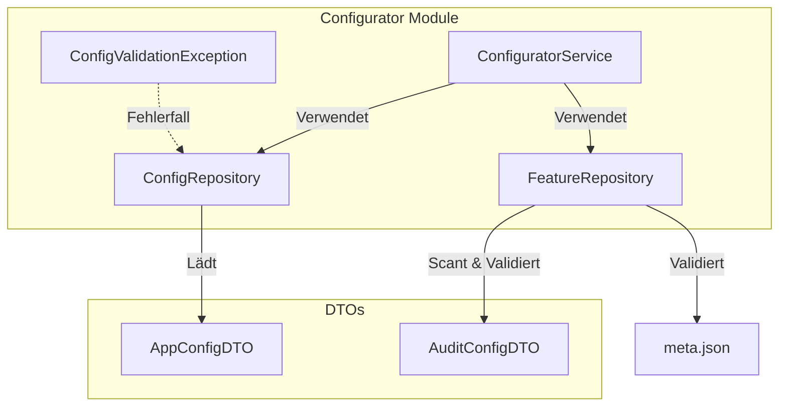

# Configurator Feature

## Übersicht

Das **Configurator**-Feature dient als zentrale Komponente für:
- **Feature-Discovery**: Erkennung und Verwaltung von Subsystemen (z. B. `meta.json` in jedem Feature-Verzeichnis).
- **Konfigurationsverwaltung**: Laden und Validieren von globalen Applikationskonfigurationen (`app_config.json`).
- **Audit-Integration**: Erzwingung bestimmter Sicherheits- und Logging-Richtlinien für Features.

---

## Feature-Architektur



---

## Funktionen

### **1. Feature-Discovery**
- Discovery aller Subsysteme, die eine Datei `meta.json` enthalten.
- Validation von `meta.json` über spezifische DTOs (z. B. `AuditConfigDTO`).
- Erzeugt ein Feature-Registry-System durch das Scannen von definierten Root-Ordnern.

### **2. Globale App-Konfiguration**
- Lädt globale Applikationskonfiguration:
  - Beispiel: Datenbank-Pfade, Session-Settings, Audit-Level-Defaults.
- Verwendet ein flexibles Strict/Nicht-Strict Verhalten:
  - **Strict**: Validierungsfehler führen zu Exceptions.
  - **Nicht-Strict**: Wendet Standardwerte an, sobald Fehler auftreten.

### **3. Audit-Enforcement**
- Nutzt `meta.json` pro Feature zur Definition von:
  - **Critical Actions**: Aktionen, die immer geloggt werden.
  - **Retention**: Konfigurierbare Speicherzeit für Audit-Logs.
  - **Log Level Requirements**: Minimal geforderter Log-Level.

---

## Komponenten

### 1. **DTOs**

#### **AppConfigDTO**
Globale Konfigurationsstruktur mit Defaults:
```python
@dataclass
class AppConfigDTO:
    app_name: str = "QMToolV6"
    app_version: str = "0.1.0"
    db_path: str = "qmtool.db"
    default_log_level: str = "INFO"
    default_retention_days: int = 365
    session_timeout_minutes: int = 60
    max_failed_logins: int = 5
```

#### **AuditConfigDTO**
Feature-spezifische Audit-Konfiguration:
```python
@dataclass(frozen=True)
class AuditConfigDTO:
    must_audit: bool = False
    min_log_level: str = "INFO"
    critical_actions: Optional[List[str]] = None
    retention_days: int = 365
```

---

### 2. **Repositories**

#### **ConfigRepository**
Verwalten der globalen Applikationskonfiguration (`app_config.json`):
```python
repo = ConfigRepository(project_root=".")
config = repo.load_app_config()
print(config.db_path)  # → "qmtool.db"
```

#### **FeatureRepository**
Discovery und Validierung der Features:
```python
repo = FeatureRepository(features_root="features")
descriptors = repo.discover_all()
for desc in descriptors:
    print(desc.feature_id)
```

---

## Verwendung

### **1. Instanziierung von Repositories**
```python
from configurator.repository.config_repository import ConfigRepository
from configurator.repository.feature_repository import FeatureRepository
config_repo = ConfigRepository(project_root=".")
feature_repo = FeatureRepository(features_root="features")
```

### **2. App-Konfiguration laden**
```python
config = config_repo.load_app_config(strict=True)
print(config.default_log_level)  # → "INFO"
```

### **3. Feature-Discovery durchführen**
```python
features = feature_repo.discover_all()
for feature in features:
    print(f"Feature discovered: {feature.id}")
```

---

## Sicherheitsmaßnahmen

1. **Audit-Validierung**:
   - Features ohne `must_audit=True` werden nicht initialisiert.
   - Die Konformität wird durch das `AuditConfigDTO` geprüft.

2. **Konfigurationsvalidierung**:
   - **Strict Mode**: Ungültige Werte (z. B. negative `timeout_minutes`) werfen Exceptions.
   - **Non-Strict Mode**: Verwendet Fallback-Defaults.

---

## Erweiterungsmöglichkeiten

1. **Cachen von Features**:
   - Hinzufügen eines Caches im `FeatureRepository`, um die Discovery zu optimieren.

2. **Validation-Erweiterung**:
   - Feature-spezifische Felder in `meta.json` können optional validiert werden.

3. **Testabdeckung**:
   - Implementierung von Unit- und Integration-Tests für die Repositories.

---

## Testen

### **Beispieltest 1: config/app_config.json**
```bash
# Alle Tests ausführen
pytest configurator/tests/ --cov=configurator --cov-report=html
```

### **Beispieltest 2: Feature-Discovery**
```python
def test_feature_discovery():
    repo = FeatureRepository(features_root="test_features")
    features = repo.discover_all()
    assert len(features) > 0
```

---

## Changelog

### **v1.0.0**
- ✅ Initial Release.
- ✅ Feature-Discovery implementiert.
- ✅ Globale Konfigurationsverwaltung.
- ✅ Audit-Integration über DTOs.

---

## Lizenz

Eigentum von QMToolV6 - Alle Rechte vorbehalten.