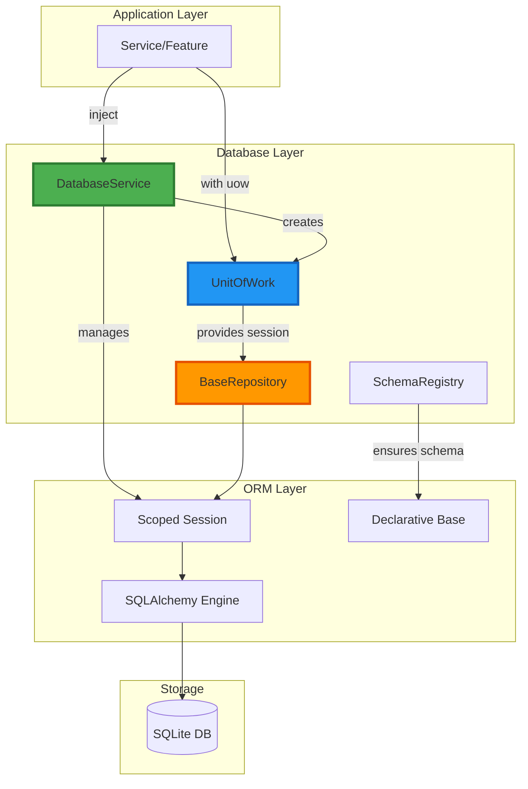

# Database Core Feature

## Overview

The Database Core Feature provides centralized database infrastructure for QMToolV6. It implements modern patterns using SQLAlchemy 2.0 with thread-local sessions and the Unit-of-Work pattern.

## Key Features

- **SQLAlchemy 2.0**: Modern ORM with type safety
- **Thread-Local Sessions**: Thread-safe database access via `scoped_session`
- **Unit-of-Work Pattern**: Transactional boundaries with `database_service.unit_of_work()`
- **BaseRepository**: Common CRUD operations for all repositories
- **Schema Registry**: Automatic schema initialization and migration support
- **Legacy Support**: Direct `sqlite3.Connection` access for legacy code
- **Health Checks**: Database connectivity and performance monitoring

## Architecture



## Usage

### Dependency Injection

Services receive `database_service` via dependency injection:

```python
from database.logic.services.database_service_interface import DatabaseServiceInterface

class MyService:
    def __init__(self, database_service: DatabaseServiceInterface):
        self._database_service = database_service
```

### Unit-of-Work Pattern

All database operations should use the Unit-of-Work pattern:

```python
# Within a service method
def create_user(self, user_data: CreateUserDTO) -> UserDTO:
    with self._database_service.unit_of_work() as uow:
        # Get repository from UoW
        user_repo = uow.get_repository(UserRepository)
        
        # Perform operations
        user = user_repo.create(user_data)
        
        # Commit happens automatically on context exit
        return user.to_dto()
```

### Repository Pattern

Extend `BaseRepository` for custom repositories:

```python
from database.logic.repository.base_repository import BaseRepository
from database.models.base import Base

class UserEntity(Base):
    __tablename__ = "users"
    id = Column(Integer, primary_key=True)
    username = Column(String(50), unique=True, nullable=False)

class UserRepository(BaseRepository[UserEntity]):
    def __init__(self, session):
        super().__init__(UserEntity, session)
    
    def get_by_username(self, username: str) -> Optional[UserEntity]:
        return self._session.query(self.entity_class).filter_by(username=username).first()
```

### Legacy Connection Access

For raw SQL or legacy code:

```python
# Get thread-local SQLite connection
conn = database_service.get_connection()
cursor = conn.cursor()
cursor.execute("SELECT * FROM users")
results = cursor.fetchall()
```

## Directory Structure

```
database/
├── meta.json                           # Feature metadata
├── README.md                           # This file
├── gui/
│   └── __init__.py                    # Empty (Core feature, no UI)
├── logic/
│   ├── __init__.py
│   ├── dto/
│   │   ├── __init__.py
│   │   └── connection_info_dto.py    # Connection information DTO
│   ├── enum/
│   │   ├── __init__.py
│   │   └── db_engine_enum.py         # Database engine types
│   ├── exceptions/
│   │   ├── __init__.py
│   │   ├── database_exception.py     # Base database exceptions
│   │   └── transaction_exception.py  # Transaction-specific exceptions
│   ├── repository/
│   │   ├── __init__.py
│   │   └── base_repository.py        # Base CRUD repository
│   └── services/
│       ├── __init__.py
│       ├── database_service_interface.py  # DatabaseService contract
│       ├── database_service.py            # SQLite implementation
│       ├── schema_registry.py             # Schema management
│       ├── unit_of_work.py                # Transaction management
│       └── healthcheck_service.py         # Health monitoring
├── models/
│   ├── __init__.py
│   └── base.py                        # SQLAlchemy Declarative Base
└── tests/
    ├── __init__.py
    ├── conftest.py                    # Test fixtures
    ├── test_database_service.py
    ├── test_unit_of_work.py
    ├── test_base_repository.py
    └── test_schema_registry.py
```

## Contract (DI Interface)

### DatabaseService Interface

```python
@abstractmethod
def get_session() -> Session:
    """Get thread-local session for current thread."""
    
@abstractmethod
def get_connection() -> sqlite3.Connection:
    """Get thread-local raw SQLite connection for legacy code."""
    
@abstractmethod
def unit_of_work() -> ContextManager[UnitOfWork]:
    """Create a Unit-of-Work for transactional operations."""
    
@abstractmethod
def close() -> None:
    """Close all sessions and connections."""
```

### UnitOfWork Interface

```python
@abstractmethod
def commit() -> None:
    """Commit the transaction."""
    
@abstractmethod
def rollback() -> None:
    """Rollback the transaction."""
    
@abstractmethod
def get_repository(repo_class: Type[T]) -> T:
    """Get a repository instance for the current session."""
```

## Thread Safety

- **Scoped Sessions**: Each thread gets its own session via `scoped_session`
- **Thread-Local Connections**: Legacy `sqlite3.Connection` per thread
- **No Shared State**: All database state is thread-local
- **Context Managers**: Proper cleanup via `with` statements

## Schema Management

The `SchemaRegistry` ensures all tables are created at startup:

```python
from database.logic.services.schema_registry import SchemaRegistry

# Register all entity classes
registry = SchemaRegistry(engine)
registry.ensure_schema()  # Creates all tables
```

## Health Checks

Monitor database health:

```python
from database.logic.services.healthcheck_service import HealthcheckService

health_service = HealthcheckService(database_service)
status = health_service.check_health()

if status.is_healthy:
    print(f"Database OK: {status.response_time_ms}ms")
else:
    print(f"Database ERROR: {status.error_message}")
```

## Future Enhancements

- **Alembic Integration**: Database migrations
- **Connection Pooling**: Advanced pool configuration
- **Multi-Database Support**: PostgreSQL, MySQL
- **Read Replicas**: Read/write splitting
- **Query Logging**: SQL query analysis
- **Performance Metrics**: Query performance tracking

## Dependencies

- SQLAlchemy >= 2.0
- Python >= 3.10

## Testing

Run tests:
```bash
pytest database/tests/ -v
```

With coverage:
```bash
pytest database/tests/ --cov=database --cov-report=html
```

## Version History

- **1.0.0**: Initial implementation
  - SQLAlchemy 2.0 support
  - Thread-local sessions
  - Unit-of-Work pattern
  - BaseRepository
  - Schema Registry
  - Legacy connection support
