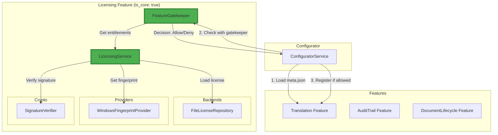

# Licensing Feature

Hardware-based offline licensing system with feature entitlements for QMToolV6.

## 🎯 Overview

The Licensing feature provides:
- **Hardware-bound licenses**: Machine fingerprinting using Windows registry and WMI
- **Offline verification**: No internet connection required
- **Feature entitlements**: Granular control over which features are enabled
- **Cryptographic signatures**: RSA/ECDSA signature verification (MVP uses hash-based)
- **Flexible backend**: Interface-based design supports future online licensing

## 🏗️ Architecture



## 📁 Structure

```
licensing/
├── meta.json                       # Feature metadata (is_core: true)
├── MODELS/
│   ├── dto/                       # Data Transfer Objects
│   │   ├── license_dto.py
│   │   ├── entitlements_dto.py
│   │   ├── machine_fingerprint_dto.py
│   │   ├── verification_result_dto.py
│   │   └── gate_decision_dto.py
│   └── enums/                     # Enumerations
│       ├── license_status.py      # VALID, MISSING, EXPIRED, etc.
│       └── license_error_code.py  # Error codes
├── LOGIC/
│   ├── interfaces/                # Contracts
│   │   ├── license_backend_interface.py
│   │   ├── licensing_service_interface.py
│   │   ├── machine_fingerprint_provider_interface.py
│   │   └── feature_gatekeeper_interface.py
│   ├── services/                  # Business Logic
│   │   ├── licensing_service.py   # Main service
│   │   └── feature_gatekeeper.py  # Feature enforcement
│   ├── repositories/              # Data Access
│   │   └── file_license_repository.py
│   ├── fingerprint/               # Machine Fingerprinting
│   │   └── windows_fingerprint_provider.py
│   ├── crypto/                    # Cryptography
│   │   └── signature_verifier.py
│   └── util/                      # Utilities
│       ├── canonical_json.py      # Canonical JSON for signing
│       └── path_resolver.py       # Path resolution
├── GUI/                           # Future: License status UI
└── tests/                         # Test Suite
    ├── test_licensing_models.py
    ├── test_feature_gatekeeper.py
    ├── test_windows_fingerprint_provider.py
    ├── test_licensing_integration.py
    └── fixtures/
        └── example_license.qmlic
```

## 🔑 License File Format

### Contract: `qmtool-license-v1`

```json
{
  "schema": "qmtool-license-v1",
  "license_id": "LIC-2025-000123",
  "customer": "Immunologikum",
  "issued_at": "2025-12-29",
  "valid_until": "2026-12-31",
  "allowed_fingerprints": [
    "hex:9f2ca1...d9e3f7c2"
  ],
  "entitlements": {
    "translation": true,
    "audittrail": true,
    "documentlifecycle": false
  },
  "signature": "b64:MEUCIQ..."
}
```

**Location**: `%PROGRAMDATA%\QMTool\license.qmlic` (Windows) or `/var/lib/qmtool/license.qmlic` (Linux)

### Signature Verification

The signature is computed over canonical JSON (without the `signature` field):
1. Remove `signature` field from license data
2. Convert to canonical JSON (sorted keys, no whitespace)
3. Sign with private key (RSA/ECDSA)
4. Base64 encode with `b64:` prefix

## 🖥️ Machine Fingerprinting (Windows)

### Hardware Identifiers

The fingerprint uses three sources (in priority order):

1. **MachineGuid** (Primary)
   - Registry: `HKLM\SOFTWARE\Microsoft\Cryptography\MachineGuid`
   - Persistent across OS reinstalls

2. **BIOS UUID** (Secondary)
   - WMI: `Win32_ComputerSystemProduct.UUID`
   - Hardware-bound

3. **Baseboard Serial** (Optional)
   - WMI: `Win32_BaseBoard.SerialNumber`
   - Only if not generic

### Canonical Fingerprint

Format: `MG=<guid>|UUID=<uuid>|MB=<serial>`

Missing values: `-`

Example: `MG={ABC-123}|UUID={UUID-456}|MB=SN789`

### Hash

SHA256 of canonical string with `hex:` prefix:

```
hex:9f2ca1b8e7d4f3c2a5b8d1e9f6c3a7b2d4e8f1c5a9b3d7e2f6c1a8b4d9e3f7c2
```

## 📊 License Status & Error Codes

### LicenseStatus

- `VALID`: License is valid and all checks passed
- `MISSING`: License file not found
- `INVALID_FORMAT`: Invalid JSON or missing required fields
- `INVALID_SIGNATURE`: Signature verification failed
- `EXPIRED`: License has expired
- `FINGERPRINT_MISMATCH`: Machine fingerprint not allowed

### LicenseErrorCode

- `LICENSE_MISSING`
- `LICENSE_INVALID_FORMAT`
- `LICENSE_INVALID_SIGNATURE`
- `LICENSE_EXPIRED`
- `LICENSE_FINGERPRINT_MISMATCH`
- `FEATURE_NOT_ENTITLED`
- `FEATURE_META_INVALID`
- `FINGERPRINT_UNAVAILABLE`

## 🔐 Feature Enforcement

### Feature meta.json Configuration

**Core features** (always loaded):
```json
{
  "id": "licensing",
  "is_core": true
}
```

**Licensed features**:
```json
{
  "id": "translation",
  "is_core": false,
  "licensing": {
    "requires_license": true,
    "feature_code": "translation",
    "enforcement": "registry"
  }
}
```

**Feature code rules**:
- Pattern: `^[a-z0-9_]+$` (lowercase, numbers, underscores only)
- Must match entitlement key in license
- Stable and canonical

### Gatekeeper Flow

1. **Core features**: Always allowed, skip license check
2. **Non-licensed features**: Allowed without license
3. **Licensed features**:
   - Validate `feature_code` format
   - Check entitlements in license
   - Allow if `entitlements[feature_code] == true`
   - Deny otherwise with `FEATURE_NOT_ENTITLED`

## 🚀 Usage

### Basic Setup

```python
from pathlib import Path
from licensing.LOGIC.services.licensing_service import LicensingService
from licensing.LOGIC.repositories.file_license_repository import FileLicenseRepository
from licensing.LOGIC.crypto.signature_verifier import SignatureVerifier
from licensing.LOGIC.fingerprint.windows_fingerprint_provider import WindowsFingerprintProvider

# Initialize components
license_path = Path("C:/ProgramData/QMTool/license.qmlic")
verifier = SignatureVerifier()
fingerprint_provider = WindowsFingerprintProvider()

# Create backend and service
backend = FileLicenseRepository(license_path, verifier)
licensing_service = LicensingService(backend, fingerprint_provider)

# Check license status
verification = licensing_service.get_verification()
if verification.is_valid():
    print(f"License is valid: {verification.license_id}")
else:
    print(f"License error: {verification.message}")

# Get entitlements
entitlements = licensing_service.get_entitlements()
if entitlements.is_entitled("translation"):
    print("Translation feature is enabled")
```

### With Feature Gatekeeper

```python
from licensing.LOGIC.services.feature_gatekeeper import FeatureGatekeeper

# Load feature metadata
meta = {
    "id": "translation",
    "is_core": False,
    "licensing": {
        "requires_license": True,
        "feature_code": "translation"
    }
}

# Check if feature should be registered
gatekeeper = FeatureGatekeeper()
entitlements = licensing_service.get_entitlements()
decision = gatekeeper.check_feature(meta, entitlements)

if decision.allowed:
    print(f"Registering feature: {decision.feature_code}")
    # Register feature
else:
    print(f"Feature blocked: {decision.reason}")
    # Skip registration
```

## 🔄 Rehosting (Offline)

When hardware changes, customer can request license rehosting:

### Rehost Request Format

```json
{
  "schema": "qmtool-rehost-v1",
  "license_id": "LIC-2025-000123",
  "old_fingerprint": "hex:old_hash...",
  "new_fingerprint": "hex:new_hash...",
  "created_at": "2026-04-02",
  "reason": "Mainboard replaced"
}
```

### Process

1. Customer exports rehost request (future GUI feature)
2. Customer sends request to vendor
3. Vendor issues new `license.qmlic` with:
   - Updated `allowed_fingerprints` (append or replace)
   - New signature
4. Customer installs new license file

## 🧪 Testing

Run all tests:
```bash
pytest licensing/tests/ -v
```

### Test Coverage

- ✅ 10 tests for DTOs and enums
- ✅ 6 tests for feature gatekeeper
- ✅ 4 tests for Windows fingerprint provider
- ✅ 4 tests for integration scenarios

**Total**: 24 tests, all passing

### Test Scenarios

- Valid license with matching fingerprint
- Missing license file
- Expired license
- Fingerprint mismatch
- Invalid signature
- Core features bypass
- Feature entitlement checks

## 🔮 Future Enhancements

### v1.1: Online Licensing

- `OnlineLicenseRepository` implementation
- License activation via API
- Automatic license refresh
- Usage telemetry

### v1.2: GUI

- License status viewer
- Manual license upload
- Rehost request generator
- Entitlements dashboard

### v1.3: Advanced Features

- Grace period for expired licenses
- License tiers (Basic, Pro, Enterprise)
- Concurrent user limits
- Network license server

## 📝 Notes

### MVP Limitations

- Signature verification uses simple hash-based approach
- Production should use `cryptography` library with RSA/ECDSA
- Windows-only fingerprinting (Linux support via fallback)

### Security Considerations

- Private keys must be kept secure and offline
- License files should have restricted permissions
- Signatures prevent tampering but not copying (use fingerprints)

## 📚 See Also

- [Configurator Integration](../configurator/README.md)
- [Feature Discovery](../translation/README.md)
- [QMToolV6 Architecture](../readmefirst.md)
