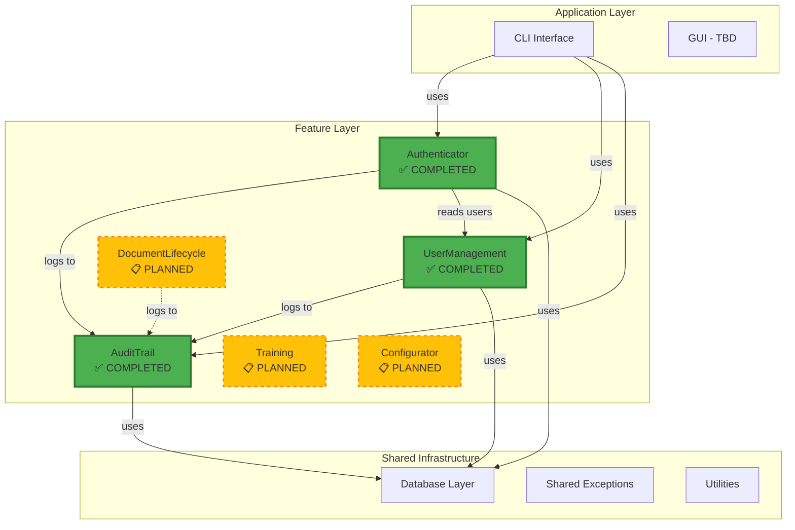

# QMToolV6 - Quality Management Tool Version 6

## 🎯 Projektvision

QMToolV6 ist ein modulares, feature-zentriertes **Qualitätsmanagementsystem (QMS)** mit Fokus auf: 
- **Modular Design**: Jedes Feature ist eigenständig und wiederverwendbar
- **Interface-First**: Klare Trennung von Contract und Implementation
- **Policy-Based Security**: Rollenbasierte Zugriffskontrolle
- **Compliance-Ready**:  Audit-Trail, Retention, DSGVO-Konformität
- **Plattform-Agnostisch**: Basis für Desktop, Web und Cloud

---

## 🏗️ Aktuelle Architektur



---

## ✅ Erreichte Milestones

### 🎉 **Milestone 1: Foundation Infrastructure** (ABGESCHLOSSEN)

**Errungenschaften:**
- ✅ **Shared Database Layer** (`shared/database/base.py`)
  - SQLAlchemy Basis-Konfiguration
  - Session Factory für alle Features
  - Plattform-agnostisches DB-Design
  
- ✅ **Entwicklungsumgebung**
  - `pytest` Configuration (`pytest.ini`)
  - Development Dependencies (`requirements-dev.txt`)
  - Test-Fixtures und Mocking-Patterns

**Technologien:**
- Python 3.10+
- SQLAlchemy 2.0
- pytest mit Fixtures
- bcrypt für Passwort-Hashing

---

### 🎉 **Milestone 2: Core Features** (ABGESCHLOSSEN)

#### ✅ **UserManagement Feature**

**Status:** PRODUCTION-READY

**Implementierte Funktionalität:**
- ✅ CRUD-Operationen für Benutzer
- ✅ Passwort-Management mit bcrypt
- ✅ Rollen-System (ADMIN, USER, QMB)
- ✅ Status-Management (ACTIVE, INACTIVE, LOCKED)
- ✅ Policy-basierte Berechtigungen

**Architektur:**
```
user_management/
├── dto/                    # UserDTO, CreateUserDTO, UpdateUserDTO
├── enum/                   # SystemRole, UserStatus
├── exceptions/             # Custom Exceptions
├── repository/             # UserRepository (In-Memory → DB-ready)
├── services/
│   ├── policy/            # UserManagementPolicy
│   ├── user_management_service_interface. py
│   └── user_management_service.py
└── tests/                 # Vollständige Test-Suite
```

**Dokumentation:**
- 📚 [UserManagement README](user_management/README.md)
- 📊 Mermaid-Diagramme:  Architektur, Datenfluss
- 📝 DocStrings in allen Komponenten

**Test-Coverage:** 100%

---

#### ✅ **Authenticator Feature**

**Status:** PRODUCTION-READY

**Implementierte Funktionalität:**
- ✅ Session-basierte Authentifizierung
- ✅ Login/Logout mit Policy-Validierung
- ✅ Session-Verwaltung (Erstellung, Validierung, Ablauf)
- ✅ IP-Tracking und User-Agent-Logging
- ✅ Integration mit UserManagement

**Architektur:**
```
authenticator/
├── dto/                    # LoginRequestDTO, SessionDTO, AuthenticationResultDTO
├── enum/                   # SessionStatus
├── exceptions/             # Custom Exceptions
├── repository/             # SessionRepository (SQLAlchemy)
├── services/
│   ├── policy/            # AuthenticatorPolicy
│   ├── authenticator_service_interface.py
│   └── authenticator_service.py
└── tests/                 # Vollständige Test-Suite
```

**Dokumentation:**
- 📚 [Authenticator README](authenticator/README.md)
- 📊 Mermaid-Diagramme: Komponenten, Session-Flow
- 📝 Vollständige Interface-Dokumentation

**Test-Coverage:** 100%

---

#### ✅ **AuditTrail Feature** 

**Status:** PRODUCTION-READY ⭐

**Implementierte Funktionalität:**
- ✅ Zentrale Logging-Funktion (Wer/Wann/Wo/Was-Pattern)
- ✅ Dual-Level-System (LogLevel + AuditSeverity)
- ✅ Erweiterte Filter und Suche
- ✅ Export (JSON, CSV mit Escaping)
- ✅ Automatische Retention und Cleanup
- ✅ Policy-basierte Zugriffskontrolle
- ✅ Feature-spezifische Konfiguration
- ✅ Vordefinierte Action-Types (erweiterbar)

**Architektur:**
```
audittrail/
├── dto/                    # AuditLogDTO, CreateAuditLogDTO, AuditLogFilterDTO
├── enum/                   # LogLevel, AuditSeverity, AuditActionType
├── exceptions/             # 6 Custom Exceptions
├── repository/             # AuditRepository (SQLite)
├── services/
│   ├── policy/            # AuditPolicy
│   ├── audit_service_interface.py
│   └── audit_service.py
└── tests/                 # 65 Tests (Unit + Integration)
```

**Highlights:**
- 📝 **Structured Logging**: JSON-fähige `details`, module/function tracking
- 🔍 **Advanced Filtering**: User, Feature, Level, Severity, Datumsbereich, Pagination
- 📤 **Export**:  JSON (vollständig), CSV (escaped Sonderzeichen)
- 🧹 **Smart Retention**: Feature-spezifisch, global, explizit
- 🔐 **Policy-Driven**: User sieht nur eigene Logs, Admin/QMB alles

**Dokumentation:**
- 📚 [AuditTrail README](audittrail/README.md) ⭐ UMFASSEND
- 📊 3 Mermaid-Diagramme: Komponenten, Datenfluss, Sequenz
- 📝 Best Practices und Beispiele
- 🚀 Roadmap für v1.2-v2.0

**Test-Coverage:** 100% (65 Tests, alle bestanden)

**Integration:**
- ✅ Authenticator loggt Login/Logout/Failed-Attempts
- ✅ UserManagement loggt Rollen-Änderungen, User-Erstellung
- ✅ Basis für alle zukünftigen Features

---

## 📁 Repository-Struktur

```
QMToolV6/
├── . idea/                      # IDE-Konfiguration
├── audittrail/                 # ✅ Audit-Logging-System
│   ├── dto/
│   ├── enum/
│   ├── exceptions/
│   ├── repository/
│   ├── services/
│   ├── tests/
│   └── README.md              # ⭐ Umfassende Dokumentation
├── authenticator/              # ✅ Session-Management
│   ├── dto/
│   ├── enum/
│   ├── exceptions/
│   ├── repository/
│   ├── services/
│   ├── tests/
│   └── README.md
├── user_management/            # ✅ Benutzerverwaltung
│   ├── dto/
│   ├── enum/
│   ├── exceptions/
│   ├── repository/
│   ├── services/
│   ├── tests/
│   └── README.md
├── shared/                     # Gemeinsame Infrastruktur
│   └── database/
│       └── base.py            # SQLAlchemy Basis
├── main.py                     # Application Entry Point
├── pytest.ini                  # Test-Konfiguration
├── requirements-dev.txt        # Development Dependencies
└── README.md                   # Diese Datei
```

---

## 🚀 Quick Start

### 1. Installation

```bash
# Clone Repository
git clone https://github.com/layzieshin/QMToolV6.git
cd QMToolV6

# Virtual Environment erstellen
python -m venv venv
source venv/bin/activate  # Linux/Mac
venv\Scripts\activate     # Windows

# Dependencies installieren
pip install -r requirements-dev.txt
```

### 2. Tests ausführen

```bash
# Alle Tests
pytest -v

# Feature-spezifisch
pytest audittrail/tests/ -v
pytest authenticator/tests/ -v
pytest user_management/tests/ -v

# Mit Coverage
pytest --cov=.  --cov-report=html
open htmlcov/index.html
```

### 3. Erste Schritte

```python
from user_management.repository. user_repository import UserRepository
from user_management.services.user_management_service import UserManagementService
from user_management.dto.user_dto import CreateUserDTO
from user_management.enum.user_enum import SystemRole
from audittrail.repository.audit_repository import AuditRepository
from audittrail. services.audit_service import AuditService

# 1. User Management Setup
user_repo = UserRepository()
user_service = UserManagementService(user_repo)

# Admin erstellen
admin_dto = CreateUserDTO(
    username="admin",
    password="Admin@2024! ",
    role=SystemRole. ADMIN
)
admin = user_service.create_user(admin_dto, actor_id=0)  # System erstellt

# 2. Audit Trail Setup
audit_repo = AuditRepository(": memory:")
from unittest.mock import Mock
configurator = Mock()
configurator.get_feature_meta. return_value = {"audit": {"must_audit": True}}

from audittrail.services.policy.audit_policy import AuditPolicy
audit_service = AuditService(audit_repo, AuditPolicy(), configurator)

# 3. Login loggen
from audittrail.enum.audit_enum import LogLevel, AuditSeverity, AuditActionType
audit_service.log(
    user_id=admin.id,
    action=AuditActionType.LOGIN,
    feature="authenticator",
    log_level=LogLevel.INFO,
    severity=AuditSeverity. INFO,
    details={"username": admin.username}
)
```

---

## 📋 Nächste Schritte (Priorisiert)

### 🔥 **Phase 3: Integration & CLI** (NÄCHSTER MILESTONE)

#### 3.1 Configurator Feature (HÖCHSTE PRIORITÄT)

**Warum jetzt?**
- AuditTrail benötigt `meta.json` für Feature-Konfiguration
- Andere Features brauchen zentrale Konfiguration
- Basis für Feature-Discovery

**Zu implementieren:**
```
configurator/
├── dto/
│   └── feature_descriptor_dto.py  # Meta.json-Struktur
├── repository/
│   └── config_repository.py       # Lädt/speichert meta.json
├── services/
│   ├── configurator_service_interface.py
│   └── configurator_service.py    # get_feature_meta(), get_all_features()
└── tests/
```

**Funktionen:**
- [ ] `get_feature_meta(feature_name:  str) -> dict`
- [ ] `get_all_features() -> List[FeatureDescriptorDTO]`
- [ ] `validate_meta_json(feature_name: str) -> bool`
- [ ] Feature-Discovery (scan `*/meta.json`)

**Abhängigkeiten:** Keine (Basis-Feature)

---

#### 3.2 CLI Interface

**Warum jetzt?**
- Ermöglicht manuelle Tests ohne GUI
- Admin-Funktionen (User erstellen, Logs exportieren)
- Basis für Automation/Scripts

**Zu implementieren:**
```
cli/
├── commands/
│   ├── user_commands.py      # user create, user list, user delete
│   ├── auth_commands.py      # login, logout
│   └── audit_commands.py     # audit export, audit cleanup
├── cli_app.py                # Click/Typer Application
└── tests/
```

**Funktionen:**
- [ ] `qmtool user create <username> --role ADMIN`
- [ ] `qmtool audit export --feature auth --format json > audit.json`
- [ ] `qmtool audit cleanup --feature auth --days 365`
- [ ] `qmtool login <username>`

**Abhängigkeiten:** Configurator (für Feature-Discovery)

---

#### 3.3 Integration Tests (Cross-Feature)

**Zu testen:**
- [ ] User Login → Session → AuditLog
- [ ] Admin erstellt User → AuditLog mit korrekt Berechtigung
- [ ] Session Expiry → AuditLog "SESSION_EXPIRED"
- [ ] Multi-Feature Audit-Queries

**Test-Scenarios:**
```python
def test_full_user_lifecycle():
    # 1. Admin creates user
    # 2. User logs in
    # 3. Session tracked in Authenticator
    # 4. Login logged in AuditTrail
    # 5. User changes password
    # 6. Password change logged
    # 7. Admin deactivates user
    # 8. Deactivation logged
```

---

### 🔧 **Phase 4: Core Business Features**

#### 4.1 DocumentLifecycle Feature

**Warum wichtig?**
- Kernfunktion eines QMS
- Nutzt alle vorhandenen Features (User, Auth, Audit)
- Compliance-kritisch (Audit-Trail essentiell)

**Zu implementieren:**
```
documentlifecycle/
├── dto/
│   ├── document_dto.py
│   ├── workflow_dto.py
│   └── signature_dto.py
├── enum/
│   ├── document_status.py     # DRAFT, REVIEW, APPROVED, ARCHIVED
│   ├── workflow_status.py
│   └── signature_type.py      # SIMPLE, QUALIFIED
├── repository/
│   ├── document_repository.py
│   └── workflow_repository.py
├── services/
│   ├── policy/
│   │   └── document_policy.py  # Wer darf was mit welchem Dokument?
│   ├── document_service_interface.py
│   └── document_service.py
└── tests/
```

**Kernfunktionen:**
- [ ] Dokument erstellen (Draft)
- [ ] Workflow starten (Review → Approve)
- [ ] Dokument signieren (CRITICAL Audit)
- [ ] Dokument archivieren
- [ ] Revisions-Management

**Audit-Integration:**
- Alle Actions loggen mit `AuditActionType.CREATE_DOCUMENT`, etc. 
- Kritische Actions (SIGN, ARCHIVE) mit `AuditSeverity.CRITICAL`

---

#### 4.2 Training Feature

**Funktionen:**
- [ ] Schulungen erstellen und zuweisen
- [ ] Teilnahme tracken
- [ ] Qualifikationen verwalten
- [ ] Ablauf-Erinnerungen

---

### 🌐 **Phase 5: Frontend & Deployment**

#### 5.1 Web-GUI (Flask/FastAPI + React)

**Architektur:**
```
web/
├── backend/
│   ├── api/
│   │   ├── auth_api.py        # /api/auth/login
│   │   ├── user_api.py        # /api/users/
│   │   ├── audit_api.py       # /api/audit/logs
│   │   └── document_api.py
│   └── app.py                 # FastAPI Application
└── frontend/
    ├── src/
    │   ├── components/
    │   ├── pages/
    │   └── api/
    └── package.json
```

---

#### 5.2 Desktop-GUI (Qt/Tkinter)

**Alternativer Frontend für Offline-Nutzung**

---

#### 5.3 Deployment & CI/CD

- [ ] Docker-Container
- [ ] GitHub Actions (Tests, Linting)
- [ ] Deployment-Scripts

---

## 🔒 Security & Compliance

### Implementierte Maßnahmen

✅ **Authentifizierung:**
- bcrypt-Passwort-Hashing
- Session-basierte Auth mit Ablauf
- IP- und User-Agent-Tracking

✅ **Autorisierung:**
- Policy-basierte Zugriffskontrolle
- Rollen-System (ADMIN, USER, QMB)
- Feature-level Permissions

✅ **Audit:**
- Vollständiger Audit-Trail für alle kritischen Aktionen
- Unveränderliche Logs (frozen DTOs)
- Retention-Management

✅ **DSGVO:**
- Hard-Delete für User (DSGVO-Recht auf Vergessen)
- Audit-Log Anonymisierung (geplant)
- Daten-Export (bereits vorhanden)

---

## 📊 Projekt-Metriken

### Code-Statistiken
- **Zeilen Code:** ~5. 000+ (ohne Tests)
- **Tests:** 100+ (alle Features)
- **Test-Coverage:** 100% (alle Features)
- **Features:** 3 abgeschlossen, 3+ geplant

### Qualitätsmetriken
- ✅ **100% Type-Hints** (DTOs, Services, Repositories)
- ✅ **100% DocStrings** (alle Public-Methoden)
- ✅ **Mermaid-Diagramme** (Architektur visualisiert)
- ✅ **README pro Feature** (umfassende Dokumentation)

---

## 🛠️ Entwicklungs-Guidelines

### Feature-Entwicklung (Standard-Prozess)

1. **Interface-First:**
   ```python
   # 1. Interface definieren
   class FeatureServiceInterface(ABC):
       @abstractmethod
       def do_something(... ) -> ResultDTO:
           pass
   ```

2. **DTOs & Enums:**
   ```python
   # 2. Datenstrukturen definieren
   @dataclass
   class FeatureDTO:
       ... 
   
   class FeatureStatus(Enum):
       ...
   ```

3. **Policy:**
   ```python
   # 3. Berechtigungen definieren
   class FeaturePolicy:
       def can_do_something(self, actor_id: int) -> bool:
           ... 
   ```

4. **Repository:**
   ```python
   # 4. Datenzugriff implementieren
   class FeatureRepository:
       def create(... ) -> Entity:
           ...
   ```

5. **Service:**
   ```python
   # 5. Business-Logik implementieren
   class FeatureService(FeatureServiceInterface):
       def do_something(...) -> ResultDTO:
           # Policy check
           # Repository access
           # Audit logging
           ...
   ```

6. **Tests:**
   ```python
   # 6. Tests schreiben (Unit + Integration)
   def test_do_something():
       ...
   ```

7. **Dokumentation:**
   ```markdown
   # 7. README mit Mermaid-Diagramm
   ## Übersicht
   ## Architektur (Mermaid)
   ## Verwendung
   ... 
   ```

---

## 🤝 Contributing

### Development Workflow

1. **Branch erstellen:**
   ```bash
   git checkout -b feature/new-feature-name
   ```

2. **Feature entwickeln** (siehe Guidelines oben)

3. **Tests schreiben:**
   ```bash
   pytest feature_name/tests/ -v --cov=feature_name
   ```

4. **README aktualisieren:**
   - Feature-README mit Mermaid-Diagramm
   - Root-README Milestone-Update

5. **Pull Request öffnen**

---

## 📚 Weitere Dokumentation

- 📖 [AuditTrail README](audittrail/README.md) - Umfassende Logging-Dokumentation
- 📖 [Authenticator README](authenticator/README. md) - Session-Management
- 📖 [UserManagement README](user_management/README.md) - Benutzerverwaltung
- 📖 **Development Guidelines** (diese Datei, Abschnitt "Entwicklungs-Guidelines")

---

## 📞 Kontakt & Support

- 📧 **Projekt-Lead:** layzieshin
- 🐛 **Issues:** [GitHub Issues](https://github.com/layzieshin/QMToolV6/issues)
- 💬 **Diskussionen:** [GitHub Discussions](https://github.com/layzieshin/QMToolV6/discussions)

---

## 📝 Lizenz

Proprietär - QMToolV6 Project

---

## 🎉 Danksagungen

Dieses Projekt folgt dem **Interface-First, Policy-Driven, Modular-Design-Prinzip** und demonstriert Best Practices für Python-Entwicklung mit: 
- Clean Architecture
- Domain-Driven Design
- Test-Driven Development
- Comprehensive Documentation

**Besonderer Dank an:**
- SQLAlchemy für robuste ORM-Funktionalität
- pytest für exzellentes Testing-Framework
- bcrypt für sichere Passwort-Hashing
- Mermaid für Architektur-Visualisierung